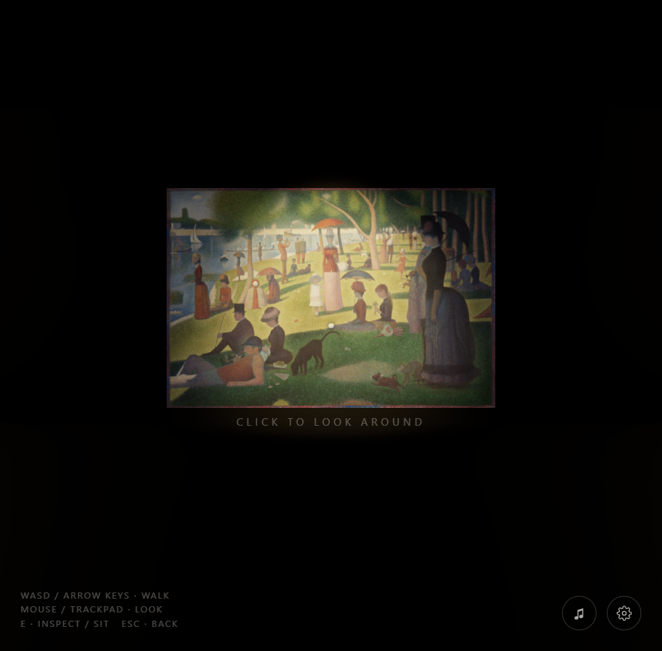
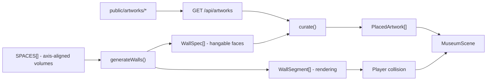

<div align="center">

# Museum Engine

**A folder of images becomes a gallery you can walk through.**

**Live demo:** https://museum-engine.vercel.app/

[](https://nextjs.org)
[](https://docs.pmnd.rs/react-three-fiber)
[](https://www.typescriptlang.org)
[](LICENSE)



<sub>The entry sightline. Every spotlight, wall and hang position here was generated at runtime from a folder of images.</sub>

</div>

Museum Engine is a cinematic, first-person digital museum that runs in the
browser. Visitors fade in from black to a quiet title wall, step through opening
doors, and walk a concrete gallery where the collection hangs as frameless
prints under warm spotlights.

It is a museum **engine**, not an image gallery. You do not place anything by
hand: the architecture, the hang line, the spotlight rig and the curation are
all generated at runtime from whatever images happen to be in a folder. A
visual editor is included for when you *do* want to place things by hand.

The demo exhibition ships with eight public-domain paintings from the
Art Institute of Chicago, so the repository runs end to end immediately after
`npm install`. See [Credits](#credits).

### The interesting part

Naive per-artwork lighting does not scale: a few dozen shadow-casting
spotlights will collapse the frame rate in any browser. This engine keeps a
small **pool of real spotlights** and continuously reassigns them to whichever
artworks are nearest the visitor, while everything further away stays legible
through emissive maps. The visitor always sees genuinely lit work in front of
them, and the renderer never pays for the rest of the building. That is what
allows hundreds of artworks to hold 60 fps.

---

## Highlights

- **Cinematic opening** — black screen → deep-navy title wall with soft lighting
  → gentle typography → a quiet "Click anywhere to enter" → fade to black → door
  sound → doors open → the camera walks in. No loading screen, no menus.
- **First-person museum navigation** — 170 cm eye height, slow museum pace,
  smooth acceleration/deceleration with camera inertia. WASD + mouse look +
  wheel zoom on desktop; virtual joystick + touch look on mobile.
- **Frameless mounted prints** — every artwork is a real 3D `PlaneGeometry`
  textured with the source image, mounted flush to the wall like a museum print.
- **Museum-quality lighting** — a dynamic pool of real spotlights follows the
  artworks nearest the visitor (with soft shadows), while distant works stay
  legible via emissive maps. This is what lets **hundreds of artworks run at
  60 fps**.
- **Inspect mode** — approach a work, press **E**, and the camera glides in so
  the piece fills the view while the gallery stays visible behind it. **Esc**
  returns you to walking.
- **Auto image import** — every image in `public/artworks/` (and its sub-folders,
  which become collections) is detected automatically. Drop new files in and
  they appear. No JSON editing, no code.
- **Visual layout editor** (`/editor`) — drag artworks across walls, resize,
  rotate, duplicate, delete, snap to wall, toggle grid, tune each spotlight,
  edit labels, undo/redo, and publish. No coding required.
- **Admin panel** (`/admin`) — password-gated upload / delete of images and
  collection management.
- **Synthesized audio** — a subtle air-conditioning hum, soft footsteps, and a
  door sound, generated with the Web Audio API (no asset files required).
- **Minimal map, save system, responsive, accessible** — live minimap with
  visitor location and progress; visited-artwork tracking; reduced-motion,
  adjustable walking speed, volume/mute; desktop, laptop, tablet, and mobile.

---

## Tech stack

| Area        | Choice |
|-------------|--------|
| Framework   | Next.js 15 (App Router) |
| UI          | React 19, TypeScript, TailwindCSS |
| 3D          | Three.js, React Three Fiber v9, Drei v10 |
| Motion      | GSAP-ready, Framer Motion (HUD/cinematic transitions) |
| State       | Zustand |
| Audio       | Web Audio API (Howler.js-ready) |
| Backend     | File-based by default; optional Supabase / Postgres + Prisma |

---

## Project structure

```
museum-engine/
├─ public/artworks/            # Imported images (collections = sub-folders)
│  └─ CREDITS.md               # Provenance of every bundled work
├─ data/layout.json            # Published layout (created on first save)
├─ prisma/schema.prisma        # Optional Postgres/Supabase schema
├─ scripts/
│  ├─ fetch-artworks.mjs        # Downloads the public-domain demo exhibition
│  └─ import-artworks.mjs       # Copies images from your source folder
└─ src/
   ├─ app/
   │  ├─ page.tsx               # The museum experience (client-only)
   │  ├─ editor/page.tsx        # Visual layout editor
   │  ├─ admin/page.tsx         # Admin dashboard
   │  └─ api/
   │     ├─ artworks/route.ts   # Auto-detects images in public/artworks
   │     ├─ layout/route.ts     # GET/POST the published layout
   │     └─ admin/…             # auth / upload / delete
   ├─ components/
   │  ├─ museum/                # 3D engine: Environment, Artwork, SpotlightPool,
   │  │                          #   Doors, FirstPersonController, MuseumScene,
   │  │                          #   MuseumExperience
   │  ├─ ui/                    # TitleWall, InspectOverlay, Minimap, Hud,
   │  │                          #   SettingsPanel, MobileControls
   │  └─ editor/                # EditorScene, EditorUI (Toolbar + Inspector)
   ├─ hooks/useMuseumData.ts    # Loads sources + layout, hydrates the store
   └─ lib/                      # types, config, store, editorStore, audio, input
```

### How the building is generated

Nothing in the gallery is modelled in a 3D program. `src/lib/config.ts` declares
the floor plan as data and the geometry is derived from it at runtime.

The shipped plan is a single enclosed gallery: a 20 m x 18 m room with a 5.4 m
ceiling, no doorways, and the entry hero piece centred on the north wall so it
is the first thing in the visitor's sightline as they walk in.



- A `Space` is an axis-aligned volume with its own ceiling height. Adding more
  entries to `SPACES`, plus `Doorway`s to carve openings out of shared walls,
  produces a multi-room building with no other code changes; the wall generator
  already emits lintels above openings and supports freestanding partitions.
- Wall geometry is emitted once as `WallSegment`s and used for **both rendering
  and collision**, so the walls you see are exactly the walls you bump into.
  The player is a circle that slides along them.
- Only interior faces at least 3 m wide become `mountWalls`, which is what stops
  the curator from hanging a painting on a narrow sliver of wall.
- **Curation** (`curate()`) places every source image across the available
  faces with a size hierarchy, a minimum gap, a consistent 1.5 m eye-line, and
  a reserved radius around the hero piece so nothing crowds it. It is
  deterministic, so the same folder always produces the same exhibition.

Camera: FOV 65 degrees, eye height 1.68 m, 1.8 m/s walking pace with
acceleration and damping, plus subtle head-bob and sway that are disabled under
`prefers-reduced-motion`.

---

## Prerequisites

- Node.js 18.18+ (tested on Node 25)
- npm

---

## Installation

```bash
# 1. Install dependencies
npm install

# 2. Run it
npm run dev
```

That is the whole setup. The demo exhibition is committed to
`public/artworks/`, so the gallery is populated on first load with no
configuration, no API keys and no database.

**To hang your own collection**, drop images into `public/artworks/` (any
`.jpg`, `.jpeg`, `.png` or `.webp`; sub-folders become named collections) and
reload. To pull the public-domain demo set again:

```bash
npm run fetch:artworks   # re-downloads from the Art Institute of Chicago
```

To bulk-import from a folder elsewhere on your machine, point
`ARTWORK_SOURCE_DIR` at it in `.env` and run `npm run import:artworks`.

## Running

```bash
# Development
npm run dev
#   → http://localhost:3000        the museum
#   → http://localhost:3000/editor  the layout editor
#   → http://localhost:3000/admin   the admin panel

# Production
npm run build
npm run start
```

> The museum owns a WebGL context and renders client-side only. The first paint
> is a black screen that fades into the title wall — this is intentional.

---

## Image import system

There are two layers, and you can use either:

1. **Bulk import from a folder** — `npm run import:artworks` copies every
   `.jpg/.jpeg/.png/.webp` from `ARTWORK_SOURCE_DIR` into
   `public/artworks/`. Sub-folders of the source become **collections**. This
   runs automatically before `npm run dev`.
2. **Drop-in / admin upload** — anything placed in `public/artworks/`
   (or uploaded via `/admin`) is auto-detected by `GET /api/artworks` on the
   next load. New images become artworks automatically, each with a texture,
   size (from the image's real aspect ratio), position, rotation, scale, a
   dedicated spotlight, and metadata.

Image dimensions are resolved at runtime from the decoded texture, so no image
processing library is needed at import time.

---

## Controls

**Desktop**

| Input | Action |
|-------|--------|
| `W A S D` / arrows | Walk |
| Mouse | Look (click the canvas to lock the pointer) |
| Mouse wheel | Zoom |
| `E` | Inspect the highlighted artwork |
| `Esc` | Leave inspect mode |

**Mobile / touch**

- Virtual joystick (bottom-left) to move
- Drag the right side of the screen to look
- Tap the **Inspect** button when near a work

---

## Using the layout editor (`/editor`)

- **Select** — click an artwork.
- **Move** — drag it; it stays snapped to its wall plane (grid snapping when
  *Snap* is on).
- **Resize / rotate / height** — the Inspector sliders (Scale, Facing, Tilt,
  Height).
- **Spotlight** — per-artwork colour, intensity, cone angle, penumbra, light
  height and distance.
- **Label** — title, artist, year, medium, description (shown in inspect mode).
- **Snap to wall / Align eye-line / Duplicate / Delete** — Inspector buttons.
- **Grid / Snap toggles, Undo, Redo** — toolbar.
- **Save · Publish** — writes the layout (see persistence below). **Preview**
  opens the live museum in a new tab.

Shortcuts: `Ctrl/Cmd+Z` undo, `Ctrl/Cmd+Shift+Z` or `Ctrl+Y` redo,
`Ctrl/Cmd+D` duplicate, `Delete` remove, `Ctrl/Cmd+S` save.

---

## Admin panel (`/admin`)

- Set `ADMIN_PASSWORD` in `.env` (defaults to `change-me` — change it).
- Log in to upload images into a named collection, browse collections, and
  delete images. Uploaded files are auto-detected by the museum and editor.

> The default gate is a simple hashed-password cookie intended for local /
> self-hosted use. For a public deployment, use Supabase Auth (below).

---

## Persistence

By default the published layout is saved to **`data/layout.json`** via
`POST /api/layout`, and read back on load. This works with zero external
services.

### Optional backend (Supabase / Postgres + Prisma)

A `prisma/schema.prisma` is included with `Collection`, `Artwork`, and `Layout`
models. To move persistence into Postgres/Supabase:

```bash
# Set DATABASE_URL / DIRECT_URL (and Supabase keys) in .env
npm run prisma:generate
npm run prisma:push
```

Then swap the file reads/writes in `src/app/api/layout/route.ts` for Prisma
queries, and replace the admin cookie gate with Supabase Auth using the
`NEXT_PUBLIC_SUPABASE_*` keys. The client-facing types in `src/lib/types.ts`
map 1:1 to the schema.

---

## Performance

The engine is built to hold a large collection at 60 fps:

- **Texture streaming / LOD** — only artworks within ~28 m of the camera decode
  their images; the rest render as light placeholders (`MuseumScene`).
- **Dynamic spotlight pool** — a fixed set of 6 real spotlights (2 casting
  shadows) follows the nearest works instead of one light per artwork.
- **Emissive maps** keep distant works legible without extra lights.
- **Throttled work** — proximity, room detection, minimap updates, and spotlight
  reassignment run at ~12 Hz, not every frame.
- **`dpr={[1, 2]}`**, frustum culling (Three.js default), and matte
  high-roughness materials to keep shading cheap.

Tuning knobs live in `src/lib/config.ts` (`PLAYER`, `ARCH`, the `SPACES` floor
plan + `curate()`) and at the top of `MuseumScene.tsx` / `SpotlightPool.tsx`.

---

## Accessibility

- **Reduced motion** — auto-detected from `prefers-reduced-motion` and toggleable
  in Settings; shortens or disables cinematic easing.
- **Adjustable walking speed** and **volume / mute** in Settings.
- **Keyboard navigation** for movement and inspect; **touch support** on mobile.

Full WCAG conformance for an immersive 3D experience requires manual testing
with assistive technologies and expert review; the above are the built-in
affordances.

---

## Deployment

### Vercel (recommended)

1. Push the repo to GitHub.
2. Import it in Vercel. Framework preset: **Next.js**. No special config needed.
3. Add env vars if using the optional backend (`DATABASE_URL`, Supabase keys,
   `ADMIN_PASSWORD`).

> Note: on Vercel the filesystem is read-only at runtime, so the default
> `data/layout.json` writes and `/admin` uploads will not persist. For a hosted
> deployment, wire persistence to Supabase/Postgres and image storage to
> Supabase Storage (or commit your images + layout to the repo). For a museum
> kiosk / self-hosted server, the file-based defaults work as-is.

### Self-hosted

```bash
npm run build
npm run start        # serves on port 3000 (override with -p)
```

Run behind a reverse proxy (nginx/Caddy) with HTTPS. The file-based layout and
admin uploads persist to disk normally here.

---

## Troubleshooting

- **No artworks appear** — confirm images exist in `public/artworks/`
  (`npm run import:artworks`) and that `GET /api/artworks` returns a non-zero
  count.
- **No audio** — audio starts on the "enter" click (browser autoplay policy).
  Check the volume/mute in Settings.
- **Pointer doesn't lock** — click the canvas while walking; some browsers block
  auto-lock without a gesture.
- **Layout didn't save on a host** — see the Vercel note above (read-only FS).

---

## Credits

The demo exhibition is eight **public-domain** works from the
[Art Institute of Chicago](https://www.artic.edu/open-access) open API. They are
downloaded by `scripts/fetch-artworks.mjs`, which refuses to save anything the
API does not flag as `is_public_domain`, and verifies that each result is by the
artist the query asked for. Full provenance for every file, with links back to
the museum record, is in
[`public/artworks/CREDITS.md`](public/artworks/CREDITS.md).

No soundtrack ships with this repository. `public/audio/` is empty by design and
the gallery runs silent until you add a track you have the right to use; the
room tone, footsteps and door sounds are synthesised at runtime with the Web
Audio API.

## License

Source code is released under the [MIT License](LICENSE).

The bundled artwork images are in the public domain and are not covered by that
license. Any images **you** add remain yours, and it is on you to have the
rights to whatever you hang on these walls.
